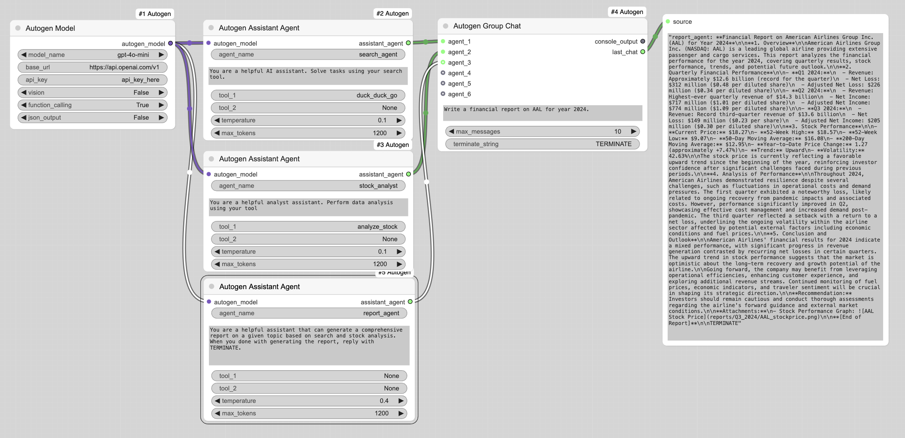

# ComfyUI-Autogen
A collection of nodes for using Autogen with ComfyUI 

[[AutoGen Stable](https://microsoft.github.io/autogen/stable/)]: assistant agents, group chats, code executor, etc.

## Features

1. **Autogen Model**  
   - Initializes an OpenAI-like model via `autogen_ext.models`.  
   - Lets you configure model name, base URL, API key, and optional capabilities like vision, function calling, and JSON output.

2. **Autogen Assistant Agent**  
   - Wraps an `AssistantAgent` from `autogen_agentchat.agents`.  
   - Lets you specify tools (by scanning a `tools` folder), temperature, max tokens, etc.  
   - Great for orchestrating more conversational or tool-using LLM tasks within ComfyUI.

3. **Autogen Code Executor**  
   - A node wrapping the `CodeExecutorAgent` from `autogen_agentchat.agents` with a local command-line executor.  
   - Enables code execution tasks, specifying a working directory, timeouts, etc.

4. **Autogen Group Chat**  
   - Leverages `RoundRobinGroupChat` to let multiple agents interact in a conversation.  
   - Terminates the chat based on a max number of messages or a specific terminate string.

## Installation
### Copy the folder
Place the ComfyUI-Autogen folder into your `ComfyUI/custom_nodes/` directory.

### Install dependencies
Activate the same Python environment (or virtual environment) that ComfyUI uses, then run:

```bash
pip install -r requirements.txt
```

### Restart ComfyUI
The nodes should appear under the “Autogen” category in your ComfyUI interface.

### Requirements:
```text
autogen-core
autogen-ext
autogen-agentchat
```
## Example 
This example uses the Company Research sample from Autogen [[here](https://microsoft.github.io/autogen/stable/user-guide/agentchat-user-guide/examples/company-research.html)]

*note the `analyze_stock` tool uses the `yfinance` library to retrieve stock information. It will need to be installed for this tool to work.

## Todo
- vision models need integration

## Contributing
Feel free to open issues or pull requests if you run into bugs, have ideas, or want to contribute enhancements. Feedback is welcome to help improve these nodes and their capabilities.
